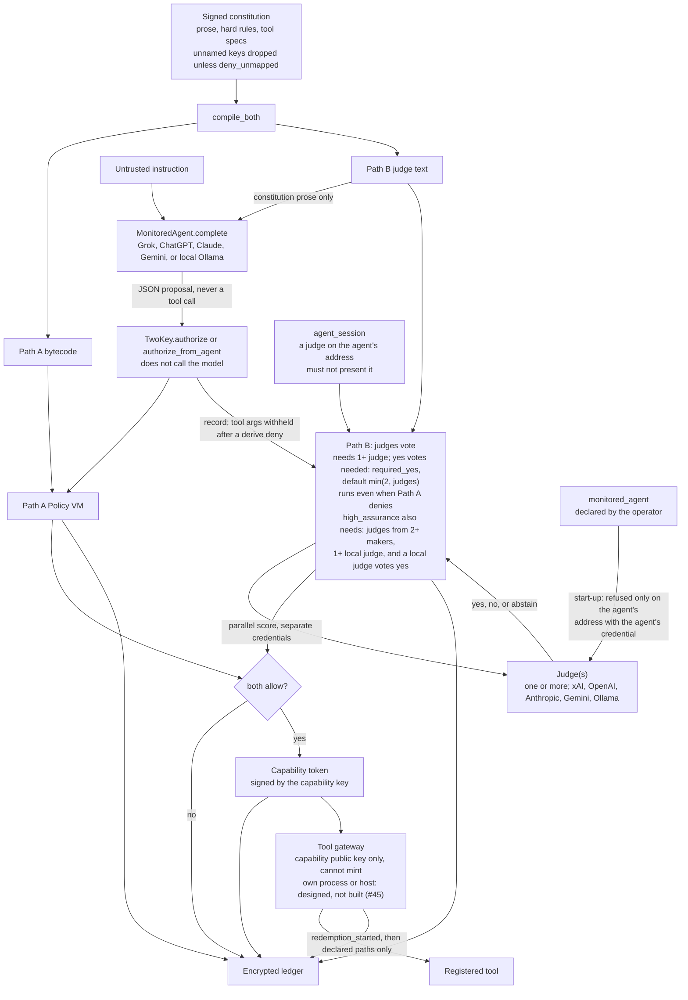
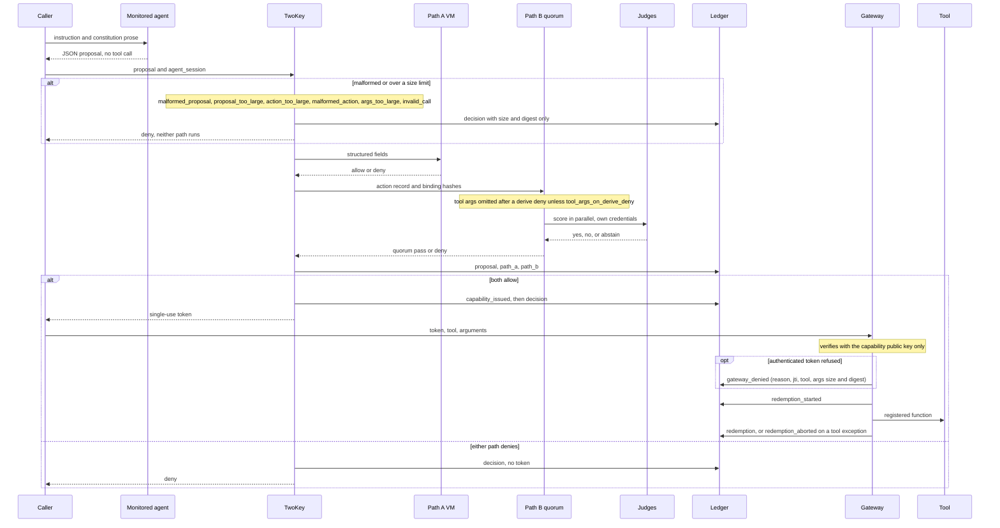
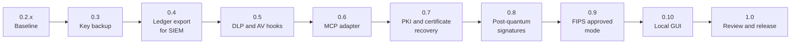

# Two-Key concept

[](https://github.com/Insomniac-VibeLabs/two-key-concept/actions/workflows/tests.yml) [](https://github.com/Insomniac-VibeLabs/two-key-concept/actions/workflows/build.yml) [](https://github.com/Insomniac-VibeLabs/two-key-concept/actions/workflows/coverage.yml) [](https://github.com/Insomniac-VibeLabs/two-key-concept/releases)
[](https://github.com/Insomniac-VibeLabs/two-key-concept/blob/v0.2.1/LICENSE) [](https://github.com/Insomniac-VibeLabs/two-key-concept/actions/workflows/security.yml)

Two independent keys must turn before an AI agent can act.

This repository is the initial concept, kept small on purpose. It has a
working ledger, Path A, Path B, and the judge and monitored-agent hooks. It does
not scan payloads and it has no antivirus or DLP hooks today. Hooks for
them, and the rest of the path to a 1.0 release, are on the
[roadmap](#roadmap).

Apache License 2.0. See [LICENSE](LICENSE).

Read [docs/FIT.md](docs/FIT.md) first, then
[docs/COMPARISON.md](docs/COMPARISON.md),
[docs/THREAT_MODEL.md](docs/THREAT_MODEL.md), and
[docs/SCOPE.md](docs/SCOPE.md), before relying on it. For where the project
is going, see [ROADMAP.md](ROADMAP.md).

## Dual-path authorization

1. Path A is a policy VM. Hard rules compile to bytecode. The VM reads only
   structured fields (`tool`, `amount_usd`, `data_class`, `counterparty`,
   `irreversible`). It does not read English. A fault is a deny. The signed
   constitution must include `tool_specs`. Those fields are read from the
   argument bytes by [two_key/derive.py](two_key/derive.py). A claim that
   disagrees with the bytes is a deny. Omitting `tool_specs` will not sign
   and will not load. A key the spec does not name does not reach the tool.
   `deny_unmapped` defaults off, so the call can still be allowed and that
   key is dropped at the gateway. The ledger records the dropped key names
   (`dropped_keys`), never their values. Set it true to deny the key
   instead. A `payload` path names a value that is not interpreted. It may
   not equal, contain, or sit under an amount, currency, or counterparty
   path; such a spec does not load. With no `shape`, it
   covers that value's children. `shape` may lock it to a string, a number,
   or a list of strings. `max_length` bounds a string or a list. Shape does
   not read the contents. The spec does not list every nested key. A counterparty
   path must list `allow`. A party that is not on that list is
   `counterparty_not_allowed`. The tool receives the canonical party, not
   the raw spelling. A value that cannot be read (for example `10**400`) is
   a `derive_failed` deny, and any other exception in `authorize` is an
   `internal_error:` deny, written to the ledger.
2. Path B is a judge quorum. Judges are hooks for xAI/Grok, OpenAI,
   Anthropic, Gemini, and Ollama. The minimum is one judge, and that judge
   must not be the monitored agent: it may run any model from any vendor,
   but not with the agent's credential on the agent's address. A missing,
   malformed, errored, or
   timed-out ballot does not count as yes. The default policy has no
   diversity floors. `QuorumPolicy.high_assurance()` (or
   `profile: high_assurance` in judges.yaml) needs judges from at least two
   model makers, at least one local judge, and a yes from a local judge; use
   it for destructive, irreversible, financial, or external-send tools. A
   judge's maker is who made its model, as the operator labels it (`maker:`,
   default: its `provider`). It is not verified, and it is a rule about the
   judges only: it is never compared with the monitored agent. `require_local_yes`
   with no local judge does not start. A judge is local only when it says
   so (`local_weights: true`) and its `base_url` host is on an allowlist:
   loopback, RFC 1918, or IPv6 unique-local. A `:cloud`/`-cloud` model is
   never local, for any judge class. With
   `required_yes` unset, the quorum needs `min(2, judges)` yes votes.
   `require_path_a_first` is not a floor and it is not a skip. After a derive
   deny, judges do not receive the argument bytes unless
   `tool_args_on_derive_deny` is set. Path B still runs. Other denies still
   attach non-empty arguments.
3. A short-lived single-use token is issued only if both paths allow. The
   token is signed by a capability key that lives outside the ledger
   directory, not by handing that private key to the gateway. It is bound
   to the tool, the argument hash, the ledger Merkle root at issuance, the
   constitution hashes, `spec_hash`, and the derived form. It lives
   `ttl_seconds` (default 120, at most 300). Redemption writes an intent before the tool
   runs, so a crash cannot run that token twice.
4. The gateway redeems that token with the public half of the capability
   key. It does not hold the minting key, and it does not inspect file
   contents, mail, or tool output for DLP or malware.

Both paths answer once the call is well-formed and within limits. A Path A deny does
not skip Path B, so the ledger has both results. A malformed or oversized
call (`malformed_proposal`, `proposal_too_large`, `action_too_large`,
`malformed_action:`, `args_too_large`, `invalid_call:`) is denied before
either path runs, and only its size and digest are ledgered.
`authorize_from_agent` does not execute the tool. An agent is untrusted whether it is hosted locally or in
the cloud.

## Architecture

A monitored agent and a Path B judge do not call each other, and neither
calls the gateway. The caller runs the agent. Two-Key then runs both paths
once the call is well-formed and within limits.
Only the gateway runs a tool.



`MonitoredAgent.complete` sends the constitution prose and the instruction.
It does not receive Path A bytecode, judge credentials, or tool credentials.
Its reply is data: `tool`, `arguments`, `proposal`, and optional structured
fields. Extra keys are rejected. `authorize_from_agent` parses that JSON,
records `agent id`, `hosting`, and `trusted: false`, and does not call the
model again. Those fields are operator/library metadata (str, at most 256
characters after strip); non-str or oversize is a deny. Hosting is local or
cloud. It is not trust, and it does not skip either path.

Path A reads only the five structured fields. Path B judges see the
normalized action record. Non-empty tool arguments are attached on that
record as `tool_args`, except after a derive deny. Set
`tool_args_on_derive_deny: true` on the quorum policy to send those bytes
anyway. Path B still runs either way. A rule deny that is not a derive deny
still attaches the arguments. The proposal string is not sent unless that
judge has `receives_proposal: true`, or the quorum policy is
`judge_inputs: record_and_proposal`. The code default, and
`examples/judges.yaml`, is `record_only`.

Judges are loaded into `TwoKey` from their own config and their own API
keys. The operator declares the monitored agent (`monitored_agent:` in
judges.yaml, or `TwoKey(monitored_agent=...)`): its model, `base_url`, and
credential. The agent's own report is never used. At start-up `TwoKey`
resolves every judge and the agent to a normalized model (Unicode forms
and dashes folded), the endpoint `host:port`, the upstream that serves it
and how that was found (`resolved_by`: `endpoint`, `model_prefix`, or
`declared_upstream`), scoped tenant ids (a `tenant:` mapping of
`organization`, `project`, `account`, or `deployment`, plus what the URL
shows), and a credential fingerprint (HMAC-SHA256 under a per-install key,
whitespace stripped; a username and password are one pair).

A judge may run any model from any vendor. It is the monitored agent, and
`TwoKey` refuses to start (`judge_matches_agent:`), only when it connects
to the agent's address (the endpoint `host:port`, every alias of this
machine folded to `localhost`) with the agent's credential: the same API
token, the same username and password, or no credential on either side, so
that nothing tells them apart. Everything else starts. Likely accidents are
allowed with a `two-key: WARNING:` line on stderr and recorded in
`constitution_loaded` (`judge_agent_separation.warnings`): the same
credential on another address, the same model on the same address, the
same model through a shared route or a local or unrecognized proxy with no
declared `upstream:`, a shared tenant id, one side keyless on the same
address, and an identity whose upstream cannot be resolved. Addresses are
compared as configured; DNS names are not resolved. A username and
password are sent as HTTP Basic over HTTPS only.
`allow_same_provider_judge` and `allow_same_model_distinct_tenant` are
accepted and have no effect. Without a declaration it refuses with
`monitored_agent_required:`. Provider labels are never compared. HOWTO has
the details.

Judges vote in parallel under one hard deadline. A missing, malformed, or
timed-out ballot is an abstention, and an abstention is not a yes. No
judge, no deadline, or two judges with the same id does not start. Each
ballot is paired with its judge by position and takes its judge id from
the judge; a ballot that names another judge abstains
(`judge_id_mismatch`). A judge
that is not on a loopback host makes the round deny when `agent_session`
is missing. If that string equals the credential of a judge, local or
cloud, that connects to a declared agent's address, the ballot abstains
with `cloud_judge_reused_agent_session` and the round denies. `X-Two-Key-Judge-Session` is a call id minted here. It is not a
session at the model host.

Without a local judge, the constitution prose, the action record, and any
attached tool arguments go to the cloud judges' vendors.

Every `decision` in the ledger records `policy_digest`, the digest of the
quorum policy in effect (opt-outs included, written in full once in
`constitution_loaded`), and `identities_digest`, the digest of the resolved
judge and agent identities written once in `constitution_loaded`: model,
upstream, endpoint, tenant ids, and credential fingerprint, never a key.

Every JSON and YAML input is parsed strictly: a repeated key at any depth
is refused, never last-one-wins. Unknown top-level keys in judges.yaml or
agents.yaml are refused. Tool arguments or a proposal over 256 KiB, or
tool arguments, the action claim, or a structured proposal nested more than
62 levels, are denied before they are ledgered.

One call, in code order:



The token is signed by the capability key (`<ledger>.capability/capability.pem`,
outside the ledger directory). It is bound to the tool, the argument hash,
the ledger Merkle root and size at issuance, the constitution hashes,
`spec_hash`, and the derived form. The gateway is constructed with
`issuer.verifier()` or with the issuer; either way it keeps only the public
half of the capability key. It recomputes the form from the same bytes. It checks the
signature, expiry, a lifetime no longer than the TTL (`ttl_too_long`), an
issue time at most 5 s ahead (`issued_in_future`), and that nothing revoked
or reloaded the constitution after issuance. It writes `redemption_started` before the tool runs. It does not
scan the bytes for sensitive text. The principal key still signs the
constitution and the ledger head. A token signed with that principal key
does not redeem, and a capability key equal to the principal key is
refused. The capability key is created once, mode 0600 in a 0700
directory. Once a token has been issued it is never regenerated: a missing
or changed key refuses to start. Its fingerprint is recorded in
`constitution_loaded` and the gateway checks it.

The gateway is meant to run in its own process or on its own host, holding
the capability public key and a gateway-only ledger role: it reads the
ledger, refreshes without ending outstanding tokens, and records
redemptions, without the principal or witness private key. That role is
designed, not yet built
([#45](https://github.com/Insomniac-VibeLabs/two-key-concept/issues/45)).
Today the gateway shares the ledger object of the `TwoKey` process, and
that object holds the principal, witness, and ledger keys.

## What this repo leaves out

Not in this repository:

- payload scanning, antivirus, and DLP hooks
- enterprise deployment modes and permissioned-chain anchoring
- X.509 / PKI identities and agent assertions
- seed-phrase backup
- hybrid ML-DSA-65

Some of this is planned as optional additions. See the
[roadmap](#roadmap): DLP and antivirus hooks (an interface that calls
external scanners, not a scanning engine), key backup (not seed-phrase
backup), PKI with certificate recovery, and hybrid ML-DSA-65. Enterprise
deployment modes, permissioned-chain anchoring, and seed phrases are not
planned.

The ledger is encrypted at rest.

Crypto here is Ed25519 and SHA-256 via the `cryptography` package. Ledger
entries and the signed head are AES-256-GCM at rest. The data key is wrapped
by a ledger key outside the ledger directory, not by the principal key. The
head is signed by the principal and by a witness key, also outside the ledger
directory. A stolen principal key cannot decrypt the log or sign a new head.
It is a prototype. It is not a FIPS 140-3 validated module.

## Known limits

- No independent review and no production deployment.
- No external anchor for the ledger. Someone holding the principal, witness,
  and ledger keys can rewrite a ledger that never leaves the machine.
- Not FIPS 140-3 validated. A FIPS approved mode that runs on a validated
  module is on the roadmap. It would not validate this package.
- Signatures are Ed25519, which is not quantum resistant. Hybrid signatures
  are on the roadmap.
- Identities are bare keys. There is no certificate chain, expiry, or
  revocation. PKI with certificate recovery is on the roadmap.
- It does not scan payloads, and it is not an antivirus or DLP product.

The full register is [docs/THREAT_MODEL.md](docs/THREAT_MODEL.md).

## Roadmap

The plan from the 0.2.1 prototype to a 1.0 release. It states intent, not a
promise. The order may change, and version numbers are targets, not dates.
Nothing below exists in 0.2.1. The detail is in [ROADMAP.md](ROADMAP.md).



| Target | What |
| --- | --- |
| 0.3 | Encrypted backup and restore of the principal, capability, ledger, and witness keys |
| 0.4 | Ledger export for a SIEM: verified, decrypted locally, no argument values |
| 0.5 | DLP and antivirus hook interface, with reference adapters for ClamAV and a secret scanner |
| 0.6 | MCP adapter: a proxy in front of the gateway, not an MCP server |
| 0.7 | PKI: X.509 identities for personal and enterprise use, and certificate recovery |
| 0.8 | Hybrid Ed25519 plus ML-DSA-65 signatures for the constitution and ledger head |
| 0.9 | FIPS approved mode: refuses to start unless running on a validated module |
| 0.10 | Local GUI for configuration and ledger auditing |
| 1.0 | Public community review, then release. Described as community-reviewed, not audited |
| After 1.0, not scheduled | Generic spec field types: a typed field per argument path |

Install from git. It is not published to PyPI. Package version 0.2.1.
Tag `v0.2.1` is on `main` and on `working`. Tag `v0.2.0` stays on commit
`2f756ac`. 0.2.0 changed configuration: read "Upgrading from 0.1.12" in
[CHANGES.md](CHANGES.md) before upgrading.

The middle column on the GitHub file list is the last commit that touched
that file, not a description of the file. The layout table below is the
description.

```bash
pip install "two-key-concept @ git+https://github.com/Insomniac-VibeLabs/two-key-concept.git@v0.2.1"
```

## Run the offline demo

```bash
python3 -m venv .venv
. .venv/bin/activate
pip install -e ".[yaml]"
python -m unittest discover -s tests
python -m two_key demo
python -m two_key authorize --help
```

The demo uses fixed test-double judges. Real judges are configured in
`examples/judges.yaml`. See [docs/HOWTO.md](docs/HOWTO.md).

## Layout

| Path | What |
| --- | --- |
| `two_key/core.py` | `TwoKey.authorize` and `authorize_from_agent` |
| `two_key/audit.py` | `check_decision_digests`: recompute each decision's `identities_digest` and `policy_digest` |
| `two_key/policy_vm.py`, `compiler.py` | Path A |
| `two_key/derive.py` | Tool-spec derivation for Path A's form |
| `two_key/quorum.py`, `two_key/judges/` | Path B and judge transport |
| `two_key/identity.py`, `netloc.py` | Judge ≠ monitored agent check; local vs. cloud host |
| `two_key/strict.py` | Strict JSON and YAML loading (duplicate keys refused) |
| `two_key/agents.py` | Monitored-agent hooks |
| `two_key/ledger.py` | Encrypted ledger; ledger key and witness live outside the directory |
| `two_key/capability.py`, `gateway.py` | Tokens and redemption. The gateway verifies only. |
| `two_key/keys.py`, `cli.py` | Key files; `two-key` command line |
| `two_key/action.py` | Normalized action record and its validation |
| `two_key/agent_meta.py` | Bounds on operator- or library-supplied agent identity metadata written to the ledger |
| `two_key/canonical.py` | Canonical encoding for the ledger, tokens, and judge bindings |
| `two_key/constitution.py` | Signed constitution: prose for Path B, hard rules for Path A, and tool specs |
| `two_key/testing.py` | Offline test doubles only; not real judges |
| `examples/` | Constitution, hard rules, judges, agents |
| `ROADMAP.md` | Planned work from 0.2.1 to 1.0 |
| `docs/HOWTO.md` | Operator how-to |
| `docs/FIT.md` | Whether this package is the right control |
| `docs/COMPARISON.md` | What this package is not a substitute for |
| `docs/THREAT_MODEL.md` | Boundaries and residual risk |
| `docs/SCOPE.md` | What this package includes, leaves out, and plans |
