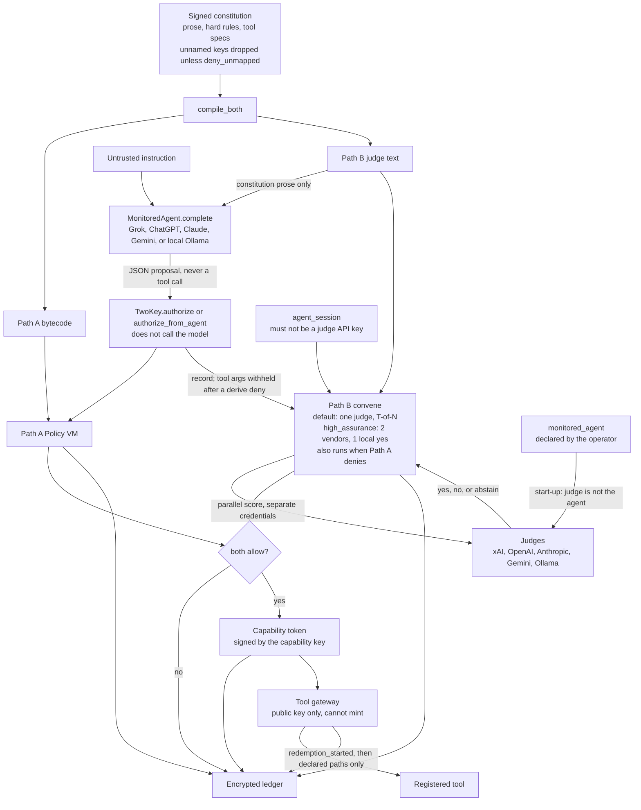
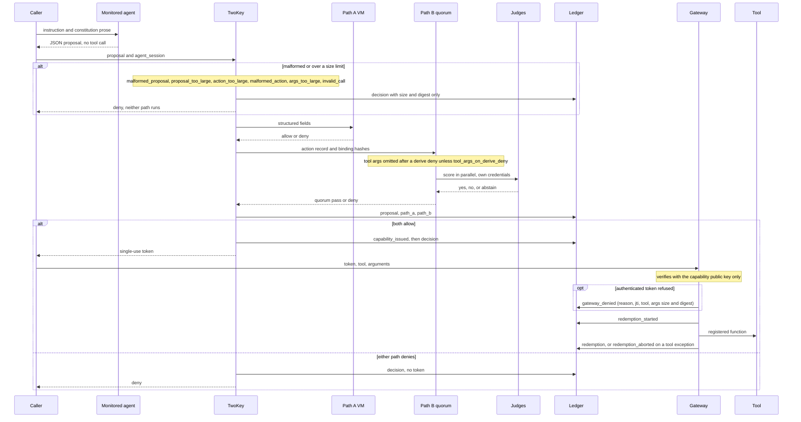

# Two-Key concept

Two independent keys must turn before an AI agent can act.

This repository is the initial concept, extracted from
[Insomniac-VibeLabs/two-key](https://github.com/Insomniac-VibeLabs/two-key)
after that line grew past the first working system. It keeps a working
ledger, Path A, Path B, and the judge and monitored-agent hooks. It does
not scan payloads and it has no antivirus or DLP hooks.

Apache License 2.0. See [LICENSE](LICENSE).

Read [docs/FIT.md](docs/FIT.md) first, then
[docs/COMPARISON.md](docs/COMPARISON.md),
[docs/THREAT_MODEL.md](docs/THREAT_MODEL.md), and
[docs/SCOPE.md](docs/SCOPE.md), before relying on it.

## What turns

1. Path A is a policy VM. Hard rules compile to bytecode. The VM reads only
   structured fields (`tool`, `amount_usd`, `data_class`, `counterparty`,
   `irreversible`). It does not read English. A fault is a deny. The signed
   constitution must include `tool_specs`. Those fields are read from the
   argument bytes by [two_key/derive.py](two_key/derive.py). A claim that
   disagrees with the bytes is a deny. Omitting `tool_specs` will not sign
   and will not load. A key the spec does not name does not reach the tool.
   `deny_unmapped` defaults off, so the call can still be allowed and that
   key is dropped at the gateway. The ledger records the dropped key names
   (`dropped_keys`), never their values. Set it true to deny the key
   instead. A `payload` path names a value that is not interpreted. It may
   not equal, contain, or sit under an amount, currency, or counterparty
   path; such a spec does not load. With no `shape`, it
   covers that value's children. `shape` may lock it to a string, a number,
   or a list of strings. `max_length` bounds a string or a list. Shape does
   not read the contents. The spec does not list every nested key. A counterparty
   path must list `allow`. A party that is not on that list is
   `counterparty_not_allowed`. The tool receives the canonical party, not
   the raw spelling. A value that cannot be read (for example `10**400`) is
   a `derive_failed` deny, and any other exception in `authorize` is an
   `internal_error:` deny, written to the ledger.
2. Path B is a judge quorum. Judges are hooks for xAI/Grok, OpenAI,
   Anthropic, Gemini, and Ollama. The minimum is one judge, and that judge
   must not be the monitored agent. A missing, malformed, errored, or
   timed-out ballot does not count as yes. The default policy has no
   diversity floors. `QuorumPolicy.high_assurance()` (or
   `profile: high_assurance` in judges.yaml) turns on two vendors, one local
   judge, and a yes from that local judge; use it for destructive,
   irreversible, financial, or external-send tools. `require_local_yes`
   with no local judge does not start. A judge is local only when it says
   so and its `base_url` host is on an allowlist: loopback, RFC 1918, or
   IPv6 unique-local. A `:cloud`/`-cloud` model is never local, for any judge class. With
   `required_yes` unset, the quorum needs `min(2, judges)` yes votes.
   `require_path_a_first` is not a floor and it is not a skip. After a derive
   deny, judges do not receive the argument bytes unless
   `tool_args_on_derive_deny` is set. Path B still runs. Other denies still
   attach non-empty arguments.
3. A short-lived single-use token is issued only if both paths allow. The
   token is signed by a capability key that lives outside the ledger
   directory, not by handing that private key to the gateway. It is bound
   to the tool, the argument hash, the ledger Merkle root at issuance, the
   constitution hashes, `spec_hash`, and the derived form. It lives
   `ttl_seconds` (default 120, at most 300). Redemption writes an intent before the tool
   runs, so a crash cannot run that token twice.
4. The gateway redeems that token with the public half of the capability
   key. It does not hold the minting key, and it does not inspect file
   contents, mail, or tool output for DLP or malware.

Both paths answer once the call is well-formed and within limits. A Path A deny does
not skip Path B, so the ledger has both results. A malformed or oversized
call (`malformed_proposal`, `proposal_too_large`, `action_too_large`,
`malformed_action:`, `args_too_large`, `invalid_call:`) is denied before
either path runs, and only its size and digest are ledgered.
`authorize_from_agent` does not execute the tool. An agent is untrusted whether it is hosted locally or in
the cloud.

## Architecture

A monitored agent and a Path B judge do not call each other, and neither
calls the gateway. The caller runs the agent. Two-Key then runs both paths
once the call is well-formed and within limits.
Only the gateway runs a tool.



`MonitoredAgent.complete` sends the constitution prose and the instruction.
It does not receive Path A bytecode, judge credentials, or tool credentials.
Its reply is data: `tool`, `arguments`, `proposal`, and optional structured
fields. Extra keys are rejected. `authorize_from_agent` parses that JSON,
records `agent id`, `hosting`, and `trusted: false`, and does not call the
model again. Hosting is local or cloud. It is not trust, and it does not
skip either path.

Path A reads only the five structured fields. Path B judges see the
normalized action record. Non-empty tool arguments are attached on that
record as `tool_args`, except after a derive deny. Set
`tool_args_on_derive_deny: true` on the quorum policy to send those bytes
anyway. Path B still runs either way. A rule deny that is not a derive deny
still attaches the arguments. The proposal string is not sent unless that
judge has `receives_proposal: true`, or the quorum policy is
`judge_inputs: record_and_proposal`. The code default, and
`examples/judges.yaml`, is `record_only`.

Judges are loaded into `TwoKey` from their own config and their own API
keys. The operator declares the monitored agent (`monitored_agent:` in
judges.yaml, or `TwoKey(monitored_agent=...)`): its model, `base_url`, and
credential. The agent's own report is never used. At start-up `TwoKey`
resolves every judge and the agent to a normalized model (Unicode forms
and dashes folded), the endpoint `host:port`, the upstream that serves it
and how that was found (`resolved_by`: `endpoint`, `model_prefix`, or
`declared_upstream`), scoped tenant ids (a `tenant:` mapping of
`organization`, `project`, `account`, or `deployment`, plus what the URL
shows), and a credential fingerprint (HMAC-SHA256 under a per-install key,
whitespace stripped). It refuses to start (`judge_matches_agent:`) only
when a judge is the same agent: the same credential, a shared tenant id,
or the same model on the same endpoint. An identity it cannot resolve also
refuses, including a local proxy serving an alias model unless you declare
its `upstream:`. The same provider with a different model is allowed and
recorded. `allow_same_provider_judge` is accepted and has no effect.
Without a declaration it refuses with `monitored_agent_required:`. The
result is in the `constitution_loaded` ledger entry. Provider labels are
never compared. HOWTO has the details.

Judges vote in parallel under one hard deadline. A missing, malformed, or
timed-out ballot is an abstention, and an abstention is not a yes. No
judge, no deadline, or two judges with the same id does not start. Each
ballot is paired with its judge by position and takes its judge id from
the judge; a ballot that names another judge abstains
(`judge_id_mismatch`). A judge
that is not on a loopback host makes the round deny when `agent_session`
is missing. If that string equals any judge's credential, local or cloud,
the ballot abstains with `cloud_judge_reused_agent_session` and the round
denies. `X-Two-Key-Judge-Session` is a call id minted here. It is not a
session at the model host.

Without a local judge, the constitution prose, the action record, and any
attached tool arguments go to the cloud judges' vendors.

Every `decision` in the ledger records `policy_digest`, the digest of the
quorum policy in effect (opt-outs included, written in full once in
`constitution_loaded`), and `identities_digest`, the digest of the resolved
judge and agent identities written once in `constitution_loaded`: model,
upstream, endpoint, tenant ids, and credential fingerprint, never a key.

Every JSON and YAML input is parsed strictly: a repeated key at any depth
is refused, never last-one-wins. Unknown top-level keys in judges.yaml or
agents.yaml are refused. Tool arguments or a proposal over 256 KiB, or
nested too deeply to encode, are denied before they are ledgered.

One call, in code order:



The token is signed by the capability key (`<ledger>.capability/capability.pem`,
outside the ledger directory). It is bound to the tool, the argument hash,
the ledger Merkle root and size at issuance, the constitution hashes,
`spec_hash`, and the derived form. The gateway is constructed with
`issuer.verifier()` or with the issuer; either way it keeps only the public
key. It recomputes the form from the same bytes. It checks the
signature, expiry, a lifetime no longer than the TTL (`ttl_too_long`), an
issue time at most 5 s ahead (`issued_in_future`), and that nothing revoked
or reloaded the constitution after issuance. It writes `redemption_started` before the tool runs. It does not
scan the bytes for sensitive text. The principal key still signs the
constitution and the ledger head. A token signed with that principal key
does not redeem, and a capability key equal to the principal key is
refused. The capability key is created once, mode 0600 in a 0700
directory. Once a token has been issued it is never regenerated: a missing
or changed key refuses to start. Its fingerprint is recorded in
`constitution_loaded` and the gateway checks it.

## What this repo leaves out

Left in the full `two-key` repository, on purpose:

- payload scanning, antivirus, and DLP hooks
- enterprise deployment modes and permissioned-chain anchoring
- X.509 / PKI identities and agent assertions
- seed-phrase backup
- hybrid ML-DSA-65

This concept line does encrypt the ledger at rest. The full repository also
has a separate at-rest design. They are not the same code.

Crypto here is Ed25519 and SHA-256 via the `cryptography` package. Ledger
entries and the signed head are AES-256-GCM at rest. The data key is wrapped
by a ledger key outside the ledger directory, not by the principal key. The
head is signed by the principal and by a witness key, also outside the ledger
directory. A stolen principal key cannot decrypt the log or sign a new head.
It is a prototype. It is not a FIPS 140-3 validated module.

Install from git. It is not published to PyPI. Package version 0.2.0, on
the `working` branch; it is not tagged yet. Tag `v0.1.12` is on `main`.
0.2.0 changes configuration: read "Upgrading from 0.1.12" in
[CHANGES.md](CHANGES.md) before upgrading.

The middle column on the GitHub file list is the last commit that touched
that file, not a description of the file. The layout table below is the
description.

```bash
pip install "two-key-concept @ git+https://github.com/Insomniac-VibeLabs/two-key-concept.git@working"   # @v0.2.0 once tagged
```

## Run the offline demo

```bash
python3 -m venv .venv
. .venv/bin/activate
pip install -e ".[yaml]"
python -m unittest discover -s tests
python -m two_key demo
python -m two_key authorize --help
```

The demo uses fixed test-double judges. Real judges are configured in
`examples/judges.yaml`. See [docs/HOWTO.md](docs/HOWTO.md).

## Layout

| Path | What |
| --- | --- |
| `two_key/core.py` | `TwoKey.authorize` and `authorize_from_agent` |
| `two_key/policy_vm.py`, `compiler.py` | Path A |
| `two_key/derive.py` | Tool-spec derivation for Path A's form |
| `two_key/quorum.py`, `two_key/judges/` | Path B and judge transport |
| `two_key/identity.py`, `netloc.py` | Judge ≠ monitored agent check; local vs. cloud host |
| `two_key/strict.py` | Strict JSON and YAML loading (duplicate keys refused) |
| `two_key/agents.py` | Monitored-agent hooks |
| `two_key/ledger.py` | Encrypted ledger; ledger key and witness live outside the directory |
| `two_key/capability.py`, `gateway.py` | Tokens and redemption. The gateway verifies only. |
| `two_key/keys.py`, `cli.py` | Key files; `two-key` command line |
| `examples/` | Constitution, hard rules, judges, agents |
| `docs/HOWTO.md` | Operator how-to |
| `docs/FIT.md` | Whether this package is the right control |
| `docs/COMPARISON.md` | What this package is not a substitute for |
| `docs/THREAT_MODEL.md` | Boundaries and residual risk |
| `docs/SCOPE.md` | What this package leaves in the full repository |
