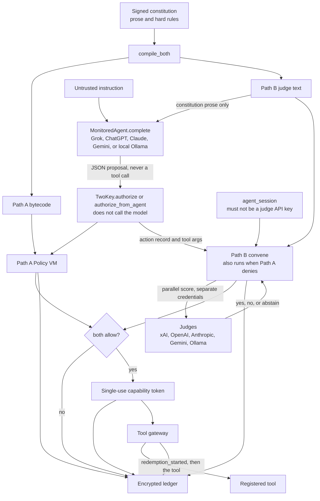
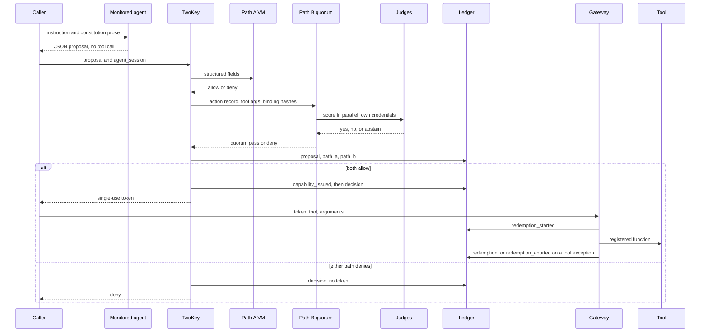

# Two-Key concept

Two independent keys must turn before an AI agent can act.

This repository is the initial concept, extracted from
[Insomniac-VibeLabs/two-key](https://github.com/Insomniac-VibeLabs/two-key)
after that line grew past the first working system. It keeps a working
ledger, Path A, Path B, and the judge and monitored-agent hooks. It does
not scan payloads and it has no antivirus or DLP hooks.

Apache License 2.0. See [LICENSE](LICENSE).

## What turns

1. Path A is a policy VM. Hard rules compile to bytecode. The VM reads only
   structured fields (`tool`, `amount_usd`, `data_class`, `counterparty`,
   `irreversible`). It does not read English. A fault is a deny.
2. Path B is a judge quorum. Judges are hooks for xAI/Grok, OpenAI,
   Anthropic, Gemini, and Ollama. A missing or malformed ballot does not
   count as yes.
3. A short-lived single-use token is issued only if both paths allow. The
   token is bound to the tool, the argument hash, and the ledger Merkle
   root at issuance. Redemption writes an intent before the tool runs, so a
   crash cannot run that token twice.
4. The gateway redeems that token. It does not inspect file contents, mail,
   or tool output for DLP or malware.

Both paths always answer. A Path A deny does not skip Path B, so the ledger
has both results. `authorize_from_agent` runs both paths and does not
execute the tool. An agent is untrusted whether it is hosted locally or in
the cloud.

## Architecture

A monitored agent and a Path B judge do not call each other, and neither
calls the gateway. The caller runs the agent. Two-Key then runs both paths.
Only the gateway runs a tool.



`MonitoredAgent.complete` sends the constitution prose and the instruction.
It does not receive Path A bytecode, judge credentials, or tool credentials.
Its reply is data: `tool`, `arguments`, `proposal`, and optional structured
fields. Extra keys are rejected. `authorize_from_agent` parses that JSON,
records `agent id`, `hosting`, and `trusted: false`, and does not call the
model again. Hosting is local or cloud. It is not trust, and it does not
skip either path.

Path A reads only the five structured fields. Path B judges see the
normalized action record. Non-empty tool arguments are attached on that
record as `tool_args`. The proposal string is not sent unless that judge
has `receives_proposal: true`, or the quorum policy is
`judge_inputs: record_and_proposal`. The code default, and
`examples/judges.yaml`, is `record_only`.

Judges are loaded into `TwoKey` from their own config and their own API
keys. Use a different key than the agent. They vote in parallel under one
deadline. A missing, malformed, or timed-out ballot is an abstention, and
an abstention is not a yes. A cloud judge makes the round deny when
`agent_session` is missing. If that string equals the judge credential, the
ballot abstains with `cloud_judge_reused_agent_session` and the round
denies. `X-Two-Key-Judge-Session` is a call id minted here. It is not a
session at the model host.

One call, in code order:



The token is bound to the tool, the argument hash, the ledger Merkle root
and size at issuance, and the constitution hashes. The gateway checks those,
plus expiry, signature, and that nothing revoked or reloaded the
constitution after issuance. It writes `redemption_started` before the tool
runs.

## What this repo leaves out

Left in the full `two-key` repository, on purpose:

- payload scanning, antivirus, and DLP hooks
- enterprise deployment modes and permissioned-chain anchoring
- X.509 / PKI identities and agent assertions
- seed-phrase backup
- hybrid ML-DSA-65

This concept line does encrypt the ledger at rest. The full repository also
has a separate at-rest design. They are not the same code.

Crypto here is Ed25519 and SHA-256 via the `cryptography` package. Ledger
entries and the signed head are AES-256-GCM at rest. The data key is wrapped
by a ledger key outside the ledger directory, not by the principal key. The
head is signed by the principal and by a witness key, also outside the ledger
directory. A stolen principal key cannot decrypt the log or sign a new head.
It is a prototype. It is not a FIPS 140-3 validated module.

Install from git. It is not published to PyPI.

The middle column on the GitHub file list is the last commit that touched
that file, not a description of the file. The layout table below is the
description.

```bash
pip install "two-key-concept @ git+https://github.com/Insomniac-VibeLabs/two-key-concept.git@v0.1.3"
```

## Run the offline demo

```bash
python3 -m venv .venv
. .venv/bin/activate
pip install -e ".[yaml]"
python -m unittest discover -s tests
python -m two_key demo
python -m two_key authorize --help
```

The demo uses fixed test-double judges. Real judges are configured in
`examples/judges.yaml`. See [docs/HOWTO.md](docs/HOWTO.md).

## Layout

| Path | What |
| --- | --- |
| `two_key/core.py` | `TwoKey.authorize` and `authorize_from_agent` |
| `two_key/policy_vm.py`, `compiler.py` | Path A |
| `two_key/quorum.py`, `two_key/judges/` | Path B and judge transport |
| `two_key/agents.py` | Monitored-agent hooks |
| `two_key/ledger.py` | Encrypted ledger; ledger key and witness live outside the directory |
| `two_key/capability.py`, `gateway.py` | Tokens and redemption, no scanning |
| `examples/` | Constitution, hard rules, judges, agents |
| `docs/HOWTO.md` | Operator how-to |
