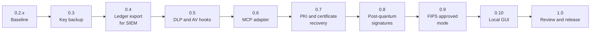

# Roadmap

This is the plan for taking `two-key-concept` from the 0.2.3 prototype to a
1.0 release. It states intent, not a promise. The order may change, and
version numbers are targets, not dates. Nothing listed here after the 0.2.x
baseline exists in 0.2.3.

Read [SCOPE.md](docs/SCOPE.md) and [THREAT_MODEL.md](docs/THREAT_MODEL.md)
for what the package does today. When an item below ships, both files change
in the same release.

## Ground rules

- A finding of Medium severity or higher blocks a release. Low and Info
  findings are tracked in issues and do not.
- New features are optional modules with their own extras. The core stays
  small.
- Each phase updates [SCOPE.md](docs/SCOPE.md) and
  [THREAT_MODEL.md](docs/THREAT_MODEL.md) before it is called done.
- Tests run in CI with free tooling. No phase depends on a paid service.
- Every signed or encrypted format carries a version and an algorithm
  identifier from 0.3 onward. That lets 0.8 add post-quantum keys without
  breaking existing ledgers or backups.

## 0.2.x: Baseline

- 0.2.2 carries two owner decisions made after this plan was written: when a
  judge counts as the monitored agent (its credential at any address, or
  both sides keyless on one address), and HTTP Basic auth for judges and
  agents. After 0.2.2, close the remaining open issues and freeze features.
- Keep the README's "Known limits" section current: no independent review,
  no external anchor, not FIPS validated, signatures not quantum resistant.

### 0.2.3 (shipped)

Two changes, both breaking, both needing the maintainer security review
that AGENTS.md asks for. Both shipped in 0.2.3 as described here; the plan
is kept as the design record. CHANGES "0.2.3" lists what was built,
including the CLI (`--witness-public-key`, `two-key rotate-witness`, and
`two-key audit`, which reports both pins).

**Pin the ledger's witness public key (#58, rated Low by the owner).**
In 0.2.2 `Ledger._verify_head` read `witness_public_key` from the stored head
and checked the witness signature against that same key, and `checkpoint`
wrote whatever key `witness.pem` held. So replacing `witness.pem` was
accepted silently, and the principal key plus the ledger key were enough to
sign a head. A pin stored only inside the ledger would not change that:
whoever holds the principal key and the ledger key can rewrite the chain
from its first entry, pin included. So the plan has two pins:

1. **In the ledger:** a new ledger records its witness public key in a
   `witness_pinned` entry, the first entry after creation, checkpointed.
   `_verify_head` and `checkpoint` refuse a head signed by another witness
   key (`witness_key_changed`), and `checkpoint` refuses to sign with a
   `witness.pem` that does not match. This catches a swapped or silently
   replaced `witness.pem` on a chain that is not rewritten. It does not
   stop someone who holds the principal key and the ledger key.
2. **Outside the ledger:** the operator can give the verifier the witness
   public key as configuration, as the gateway is given the capability
   public key (`Ledger(..., witness_public_key=...)`, and a CLI option), kept
   where whoever writes the ledger directory cannot change it. With it, a
   head also needs the witness private key, so the principal key and the
   ledger key alone no longer forge one.
3. A ledger made by 0.2.2 or earlier pins the key in its current head on its
   first open under 0.2.3 (trust on first use), with a ledgered
   `witness_pinned` entry that says so. A key swapped before the upgrade
   cannot be detected; CHANGES and THREAT_MODEL say this.
4. Changing the witness key becomes an explicit, ledgered `witness_rotated`
   entry, signed by the principal and both the old and the new witness key;
   an out-of-ledger pin is updated by the operator. A lost witness key means
   a new ledger until 0.3's key backup can restore it.
5. `Ledger.verify()` and `audit` report both pins. Tests cover a swapped
   `witness.pem` (refused), a head signed by a key other than the
   configured one (refused), an old ledger pinning on first open, and a
   rotation.
6. README, THREAT_MODEL, and SECURITY.md say what each pin detects. With the
   out-of-ledger pin configured, forging a head needs the principal,
   witness, and ledger keys together; without it, the principal key and the
   ledger key stay enough. Rolling the ledger back to an earlier signed
   head, or wiping it, stays undetected without an external anchor, with or
   without either pin.

**Remove the `vendor` / `min_vendors` aliases (owner's decision).** Every
`TODO(remove-vendor-alias)` site in `two_key/`: the `vendor:` and
`min_vendors:` config keys (then refused as unknown keys), the `vendor=` and
`min_vendors=` arguments, the `.vendor` and `.min_vendors` properties, the
`_vendor` fallback, `maker_from_vendor`, `rename_min_vendors`, and the
`QuorumPolicy.__init__` wrapper. The old-name tests become tests that the
old names are refused, and CHANGES gets an "Upgrading from 0.2.2" step.
The unused `extra_secrets` argument of `AgentDeclaration.resolve`, which
HMACs whatever it is given, goes in the same release.

## 0.3: Key backup and recovery

Losing a key today is severe. A missing or changed capability key refuses to
start, and a lost ledger key leaves the log unreadable.

- Encrypted, passphrase-protected export and restore of this package's own
  keys: principal, capability, ledger, and witness.
- The key derivation function is named in the bundle. A PBKDF2-based option
  is included so 0.9 can use only approved algorithms.
- A verify command that restores into a temporary ledger and checks
  fingerprints.
- The ledger key and the witness key are kept in separate bundles.
- A recovery runbook and a table of what each lost key means.
- Tests: restore, wrong passphrase, tampered bundle.

Not in scope here: PKI and certificate identities (see 0.7) and
seed-phrase backup.

## 0.4: Ledger export for SIEM

- A command that verifies the ledger, decrypts it locally, and writes events
  as JSON Lines.
- Events carry digests, sizes, and reason codes. They do not carry argument
  values.
- The export uses a field allowlist. It leaves out the proposal text and the
  derived amount and counterparty, which the ledger holds today.
- Field mapping to a common schema (ECS or OCSF), with optional CEF or
  syslog output. Delivery by file first, then webhook.
- An offline check that exported events match the ledger head.
- Tested against Wazuh or Elastic in Docker, with a sample dashboard.

## 0.5: DLP and AV hooks

- One interface: `inspect(args_projection)` returns allow, deny, or abstain,
  with a reason code. An error, timeout, or missing result is a deny.
- Two reference adapters that call external tools: ClamAV for file payloads
  and a secret and pattern scanner for DLP. This package does not ship its
  own scanning engine.
- The ledger records the scanner name, version, and a result digest, never
  the content.
- Design decision to settle first: run the hook before judges receive
  `tool_args`, so scanned content is not sent to cloud vendors.
- Tests use the EICAR test file and fake secrets.

## 0.6: MCP adapter

- A proxy for `tools/call` that runs `authorize` and forwards through the
  gateway only with a valid token. The package does not become an MCP
  server.
- A helper that drafts `tool_specs` from an MCP server's tool schemas. The
  output is a draft for the principal to review and sign.
- Start with stdio transport and one real server. HTTP and OAuth come later.
- The proxy adds a trust boundary: an agent that can reach the MCP server
  directly bypasses it. THREAT_MODEL.md says so.

## 0.7: PKI and certificate recovery

Today identities are bare keys. The principal, witness, capability, and agent
keys have no certificate, no chain, and no expiry or revocation. This phase
adds X.509 identities for personal and enterprise use, and a way to recover
from a lost or compromised certificate. It builds on the key backup from 0.3.

- Certificate identities for the principal, the witness, the capability
  issuer, and optionally agents. A certificate binds a name and a validity
  period to a key the package already uses. Existing bare-key setups keep
  working.
- Two shapes. Personal: one operator with a small local certificate authority
  or a self-signed root, built on the X.509 support in `cryptography`.
  Enterprise: an existing CA issues the certificates, and the package
  validates the chain against configured trust anchors.
- Validation covers chain building to a trust anchor, validity period, key
  usage, and revocation. Revocation is a signed revocation list that is also
  recorded in the ledger. Online checks such as OCSP come later.
- The certificate identity is recorded with the constitution and ledger head
  signatures, so an audit shows which identity signed what.
- Issuance, renewal, revocation, and recovery are ledger events. They carry
  digests and subject names, never private keys, and they reach the SIEM
  export from 0.4.
- Certificate recovery, personal: the 0.3 backup bundle also holds the
  certificate and chain, and a random recovery key (not a seed phrase),
  stored offline, unlocks it. Recovery restores the key and certificate, or
  re-issues from the local CA and revokes the old certificate.
- Certificate recovery, enterprise: the recovery key is split k-of-n among
  named custodians, using a vetted library rather than our own scheme.
  Recovery needs k custodians, is a ledger event, and ends with the old
  certificate revoked and a new one issued. Dual control for CA key use is
  optional.
- A lost CA key is the worst case. Document and test a root rollover: a new
  root, cross-signing, and re-issue.
- A key-provider interface, so an OS keystore or HSM can be added later.
  Direct HSM integration is not part of this phase.
- Tests: expiry, a revoked certificate, a wrong chain, wrong key usage,
  recovery with k-1 and with k shares, and a tampered bundle.

## 0.8: Post-quantum signatures

Today every signature is Ed25519, which a large quantum computer could
forge. AES-256-GCM and SHA-256 are not the concern at these sizes. The
exposure is long-lived signatures: the constitution and the ledger head.
Capability tokens live at most 300 seconds, so they come last.

- Hybrid signatures for the constitution and the ledger head: Ed25519 plus
  ML-DSA-65 (FIPS 204). The signature verifies only if both halves verify.
- Use a vetted library for ML-DSA instead of writing it, and keep the work
  sized to this repository's scope.
- A verifier that expects the hybrid form refuses a classical-only one, so
  stripping the post-quantum half is a deny, not a downgrade.
- Key backup and SIEM export carry the new keys and fields, using the
  versioned formats from 0.3.
- Decide separately whether tokens go hybrid, since they add size on every
  call.
- Certificates from 0.7 follow the same rule. Whether to issue hybrid or
  post-quantum certificates depends on the standards and library support at
  the time, and is decided then.
- Existing 0.2.x ledgers stay readable, with a documented migration.

## 0.9: FIPS approved mode

The goal is to run on a validated cryptographic module, not to claim that
this package is validated. The docs say "runs on a FIPS 140-3 validated
module in approved mode", never "FIPS compliant" or "FIPS validated".

- An opt-in mode that refuses to start unless the `cryptography` library
  runs on a FIPS 140-3 validated module (an OpenSSL FIPS provider) in
  approved mode.
- An inventory of every algorithm the package uses, including certificate
  signatures and the method used to split recovery keys. In approved mode,
  anything outside the approved set is refused, for example a non-PBKDF2
  key derivation function. Whether split-key recovery is allowed in approved
  mode is an open question, decided when the mode is built.
- Ed25519 is approved under FIPS 186-5, but support depends on the validated
  module. The startup check confirms it before allowing the mode.
- The module's certificate number and version are recorded in
  `constitution_loaded`.
- Open question, decided when the mode is built: how hybrid signatures are
  treated in approved mode, since it depends on what the validated module
  supports.
- Tests run in CI against a container that ships a validated provider.
- A document on how to deploy it and what the claim does and does not
  cover.

## 0.10: Local GUI for configuration and ledger auditing

A graphical front end so the package can be configured and audited without
hand-editing YAML and reading JSON. It is built last, on top of the stable
CLI and file formats, so it adds no new logic of its own.

- Runs locally only. It binds to loopback, requires a per-session token, and
  is not a hosted or multi-user service.
- Configuration: view and edit judges, quorum policy, agents, and tool
  specs, with validation that uses the same strict loaders as the core. It
  shows the effect of a change, such as `high_assurance`, before it is
  saved.
- The GUI never holds the principal key. It prepares a constitution and
  hands it to the existing signing command. Signing stays outside the GUI.
- Ledger auditing: browse decisions, filter by tool, reason, judge, and
  time, and show both paths' results for each call. It runs the Merkle and
  digest checks (`check_decision_digests`) and shows failures plainly.
- Filtering by judge needs per-judge ballot records, which the ledger does
  not hold today. Planned: ledger each ballot's judge id, vote, and capped
  error only, never the rationale text, which is model output and may quote
  arguments.
- Export from the audit view reuses the 0.4 export, so digests and reason
  codes leave the screen, not argument values.
- Key and backup status: fingerprints, backup age, and a prompt to run the
  verify command from 0.3. It does not display key material.
- Certificate status: validity, expiry warnings, and revocation, plus a guided
  recovery workflow that runs the 0.7 recovery commands and never displays
  key material.
- Keep dependencies small, with static assets and no external network calls.
- The 1.0 community review covers the GUI. It is the first component that
  displays decrypted ledger content.

## 1.0: Review and release

- A time-boxed, public community review with a stated scope.
- Release only with no unresolved Medium or higher findings from that review.
- Publish to PyPI with trusted publishing, signed tags, and an SBOM.
- A ten-minute quickstart and a demo with a real MCP server, including a tour of the GUI.
- 1.0 is described as community-reviewed, not audited, and as not FIPS
  validated itself. A paid audit and any validation of this package are
  later goals.

## After 1.0 (not scheduled)

Planned, with no target version.

- Generic spec field types. Today a tool spec knows two special field kinds,
  `amount` (USD or cents) and `counterparties`, plus unread `payload` paths.
  The plan is a typed field per argument path, each kind with its own
  limits: string, int, decimal, enum, identifier/principal, path, URL,
  email, and opaque bytes. `amount` and `counterparty` stop being special
  cases and become ordinary typed fields that rules can name. Until then the
  action record keeps `amount_usd` and `counterparty` as fields, with neutral
  defaults for tools that have neither.

## Not planned for this repository

- Its own antivirus or content-classification engine.
- Running as an MCP server.
- A hosted, remote, or multi-user GUI, and a GUI that holds the signing key.
- A CMVP validation of this package, and any claim that it is "FIPS
  compliant" or "FIPS validated".
- Permissioned-chain anchoring and seed phrases.
- A general-purpose certificate authority product, and direct HSM integration.
  The personal CA is minimal, and the key-provider interface leaves room for
  an HSM later.
