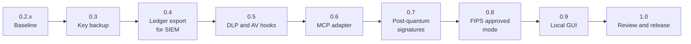

# Roadmap

This is the plan for taking `two-key-concept` from the 0.2.1 prototype to a
1.0 release. It states intent, not a promise. The order may change, and
version numbers are targets, not dates. Nothing listed here exists in 0.2.1.

Read [SCOPE.md](docs/SCOPE.md) and [THREAT_MODEL.md](docs/THREAT_MODEL.md)
for what the package does today. When an item below ships, both files change
in the same release.

## Ground rules

- A finding of Medium severity or higher blocks a release. Low and Info
  findings are tracked in issues and do not.
- New features are optional modules with their own extras. The core stays
  small.
- Each phase updates [SCOPE.md](docs/SCOPE.md) and
  [THREAT_MODEL.md](docs/THREAT_MODEL.md) before it is called done.
- Tests run in CI with free tooling. No phase depends on a paid service.
- Every signed or encrypted format carries a version and an algorithm
  identifier from 0.3 onward. That lets 0.7 add post-quantum keys without
  breaking existing ledgers or backups.

## 0.2.x: Baseline

- Close the remaining open issues and freeze features.
- Keep the README's "Known limits" section current: no independent review,
  no external anchor, not FIPS validated, signatures not quantum resistant.

## 0.3: Key backup and recovery

Losing a key today is severe. A missing or changed capability key refuses to
start, and a lost ledger key leaves the log unreadable.

- Encrypted, passphrase-protected export and restore of this package's own
  keys: principal, capability, ledger, and witness.
- The key derivation function is named in the bundle. A PBKDF2-based option
  is included so 0.8 can use only approved algorithms.
- A verify command that restores into a temporary ledger and checks
  fingerprints.
- The ledger key and the witness key are kept in separate bundles.
- A recovery runbook and a table of what each lost key means.
- Tests: restore, wrong passphrase, tampered bundle.

Not in scope: PKI or X.509 identities and seed-phrase backup.

## 0.4: Ledger export for SIEM

- A command that verifies the ledger, decrypts it locally, and writes events
  as JSON Lines.
- Events carry digests, sizes, and reason codes. They do not carry argument
  values.
- Field mapping to a common schema (ECS or OCSF), with optional CEF or
  syslog output. Delivery by file first, then webhook.
- An offline check that exported events match the ledger head.
- Tested against Wazuh or Elastic in Docker, with a sample dashboard.

## 0.5: DLP and AV hooks

- One interface: `inspect(args_projection)` returns allow, deny, or abstain,
  with a reason code. An error, timeout, or missing result is a deny.
- Two reference adapters that call external tools: ClamAV for file payloads
  and a secret and pattern scanner for DLP. This package does not ship its
  own scanning engine.
- The ledger records the scanner name, version, and a result digest, never
  the content.
- Design decision to settle first: run the hook before judges receive
  `tool_args`, so scanned content is not sent to cloud vendors.
- Tests use the EICAR test file and fake secrets.

## 0.6: MCP adapter

- A proxy for `tools/call` that runs `authorize` and forwards through the
  gateway only with a valid token. The package does not become an MCP
  server.
- A helper that drafts `tool_specs` from an MCP server's tool schemas. The
  output is a draft for the principal to review and sign.
- Start with stdio transport and one real server. HTTP and OAuth come later.
- The proxy adds a trust boundary: an agent that can reach the MCP server
  directly bypasses it. THREAT_MODEL.md says so.

## 0.7: Post-quantum signatures

Today every signature is Ed25519, which a large quantum computer could
forge. AES-256-GCM and SHA-256 are not the concern at these sizes. The
exposure is long-lived signatures: the constitution and the ledger head.
Capability tokens live at most 300 seconds, so they come last.

- Hybrid signatures for the constitution and the ledger head: Ed25519 plus
  ML-DSA-65 (FIPS 204). The signature verifies only if both halves verify.
- Use a vetted library for ML-DSA instead of writing it, and keep the work
  sized to this repository's scope.
- A verifier that expects the hybrid form refuses a classical-only one, so
  stripping the post-quantum half is a deny, not a downgrade.
- Key backup and SIEM export carry the new keys and fields, using the
  versioned formats from 0.3.
- Decide separately whether tokens go hybrid, since they add size on every
  call.
- Existing 0.2.x ledgers stay readable, with a documented migration.

## 0.8: FIPS approved mode

The goal is to run on a validated cryptographic module, not to claim that
this package is validated. The docs say "runs on a FIPS 140-3 validated
module in approved mode", never "FIPS compliant" or "FIPS validated".

- An opt-in mode that refuses to start unless the `cryptography` library
  runs on a FIPS 140-3 validated module (an OpenSSL FIPS provider) in
  approved mode.
- An inventory of every algorithm the package uses. In approved mode,
  anything outside the approved set is refused, for example a non-PBKDF2
  key derivation function.
- Ed25519 is approved under FIPS 186-5, but support depends on the validated
  module. The startup check confirms it before allowing the mode.
- The module's certificate number and version are recorded in
  `constitution_loaded`.
- Open question, decided when the mode is built: how hybrid signatures are
  treated in approved mode, since it depends on what the validated module
  supports.
- Tests run in CI against a container that ships a validated provider.
- A document on how to deploy it and what the claim does and does not
  cover.

## 0.9: Local GUI for configuration and ledger auditing

A graphical front end so the package can be configured and audited without
hand-editing YAML and reading JSON. It is built last, on top of the stable
CLI and file formats, so it adds no new logic of its own.

- Runs locally only. It binds to loopback, requires a per-session token, and
  is not a hosted or multi-user service.
- Configuration: view and edit judges, quorum policy, agents, and tool
  specs, with validation that uses the same strict loaders as the core. It
  shows the effect of a change, such as `high_assurance`, before it is
  saved.
- The GUI never holds the principal key. It prepares a constitution and
  hands it to the existing signing command. Signing stays outside the GUI.
- Ledger auditing: browse decisions, filter by tool, reason, judge, and
  time, and show both paths' results for each call. It runs the Merkle and
  digest checks (`check_decision_digests`) and shows failures plainly.
- Export from the audit view reuses the 0.4 export, so digests and reason
  codes leave the screen, not argument values.
- Key and backup status: fingerprints, backup age, and a prompt to run the
  verify command from 0.3. It does not display key material.
- Keep dependencies small, with static assets and no external network calls.
- The 1.0 community review covers the GUI. It is the first component that
  displays decrypted ledger content.

## 1.0: Review and release

- A time-boxed, public community review with a stated scope.
- Release only with no unresolved High findings from that review.
- Publish to PyPI with trusted publishing, signed tags, and an SBOM.
- A ten-minute quickstart and a demo with a real MCP server, including a tour of the GUI.
- 1.0 is described as community-reviewed, not audited, and as not FIPS
  validated itself. A paid audit and any validation of this package are
  later goals.

## Not planned for this repository

- Its own antivirus or content-classification engine.
- Running as an MCP server.
- A hosted, remote, or multi-user GUI, and a GUI that holds the signing key.
- A CMVP validation of this package, and any claim that it is "FIPS
  compliant" or "FIPS validated".
- PKI, permissioned-chain anchoring, and seed phrases.
